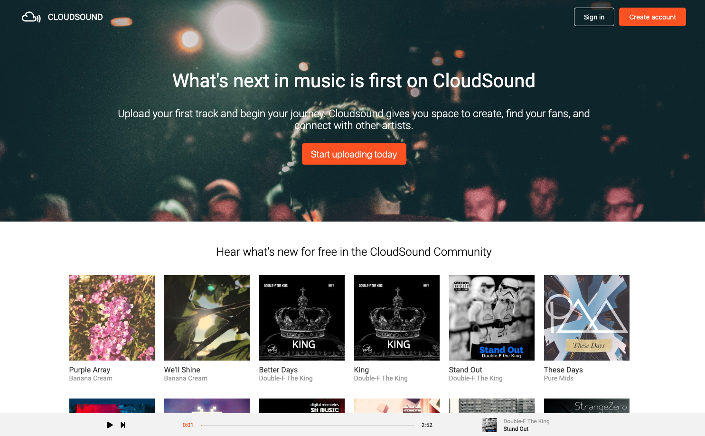

# CloudSound

> A SoundCloud clone for audio creators to share and experience music.

[CloudSound](https://cloudsound-app.herokuapp.com/#/)

CloudSound was developed as part of the App Academy curriculum. It is meant to mimic as closely as possible the functionality of SoundCloud. Users can upload songs, comment on, and listen to the library.

## Technologies Used

- Ruby on Rails
- Postgresql
- React
- Redux

### Play Button

I built the play button to be as reuseable as possible. It is passed a song object as a prop, and depending on the play status, will dispatch an action to set the current active song, and an action to set the playing boolean to true/false

### Continuous Playbar

The playbar takes care of creating an HTML audio element, whenever state is updated with a new active song. It stores the audio element in component state and takes care of calling play/pause methods.

